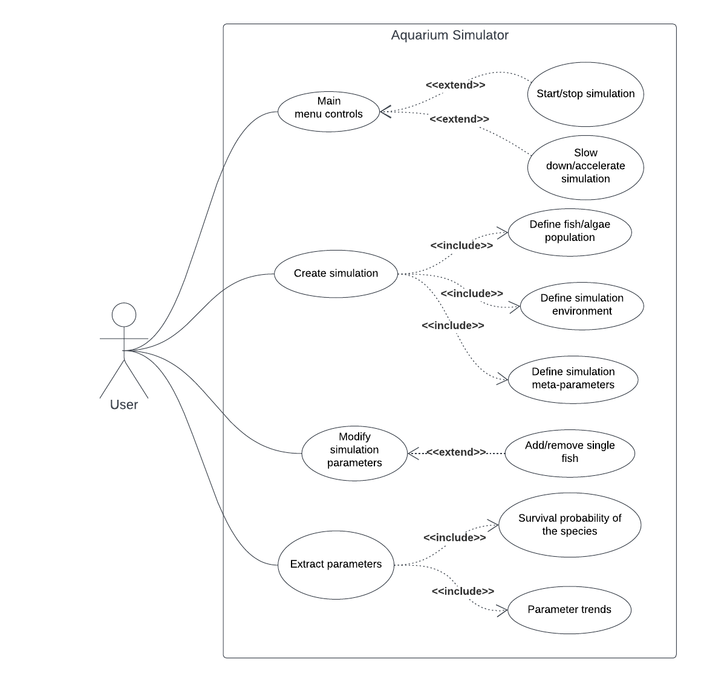
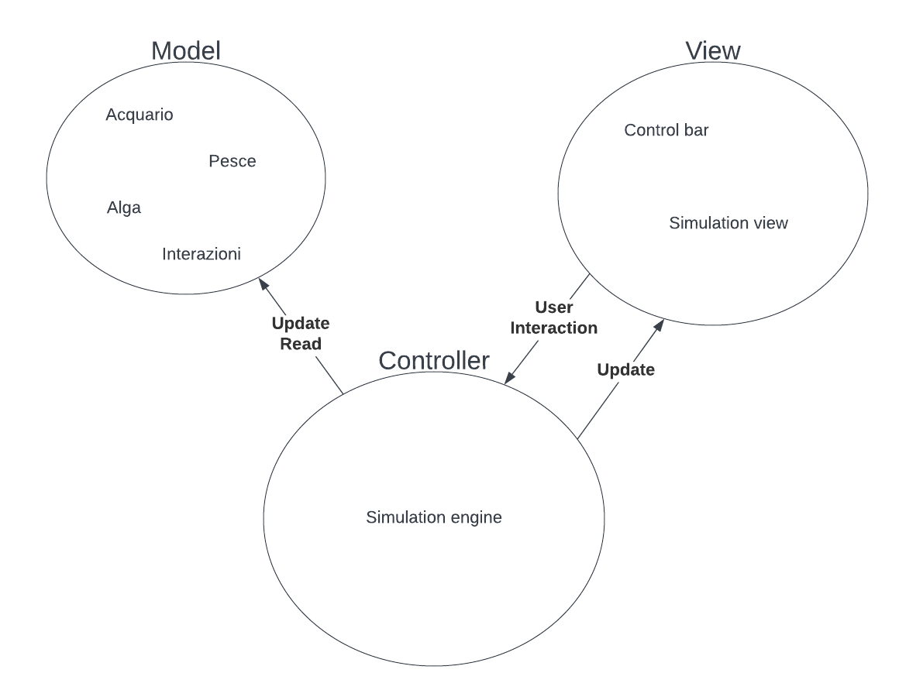

## 4 Design architetturale

### 4.1 Casi d'uso

### 4.2 Architettura complessiva

Per un'architettura idonea del progetto che vogliamo sviluppare abbiamo deciso di sfruttare il pattern MVC, separandolo quindi in tre macro componenti: Model, View e Controller, di seguito uno schema riassuntivo della composizione e interazione dei componenti:

### 4.3 Descrizione del pattern MVC

MVC (Model-View-Controller) è un pattern di design del software comunemente usato per implementare interfacce utente, dominio e logica di controllo. Il punto focale di questo pattern è la separazione tra la logica del software e l'interfaccia dell'utente, tale "separazione di concetti" permette una migliore divisione del lavoro tra team di sviluppatori. Le tre principali componenti di questo pattern sono:
<dl>
	<dt>Model</dt>
	<dd>
		Il Model definisce i dati che l'applicativo è in grado di gestire, in generale un componente passivo che supporta la lettura e scrittura da parte del controller dei dati introducendo controlli sulla loro correttezza.
	</dd>
	<dt>View</dt>
	<dd>
		La View definisce l'interfaccia che viene mostrata all'utente, include componenti grafici (scritte, immagini...) per visualizzare lo stato del sistema e componenti di input (bottoni, caselle di testo...) per informare il controller sull'input dell'utente.
	</dd>
	<dt>Controller</dt>
	<dd>
		Il Controller fa da ponte tra il Model e la View, si occupa di aggiornarli opportunamente in risposta all'input dell'utente. Nel nostro caso il Controller incapsula anche la logica di aggiornamento dei dati del Model per ogni iterazione della simulazione.
	</dd>
</dl>

È stato scelto il pattern MVC per vari motivi. 
Prima di tutto si è tenuto in considerazione che MVC è uno dei pattern più conosciuti ed utilizzati, il che rende più semplice ricercare documentazione ed esempi da cui prendere spunto. 
Oltre a ciò, dato che il team, nella sua interezza, ha già utilizzato questo pattern in altri progetti, questa scelta rappresentava la soluzione più sicura ed efficiente per realizzare un solido design architetturale per il progetto. 

### 4.4 Descrizione dettagliata delle componenti

Sottocomponenti dei macrocomponenti mvc:
* Model 
  * Acquario
  * Pesce
  * Alga
  * Modellazione delle interazioni fra i vari elementi della simulazione
* View
  * GUI
    * Control Bar
    * Simulation view
* Control
  * Simulation engine

//Diagramma delle classi

// Scelte tecnologiche cruciali ai fini architetturali